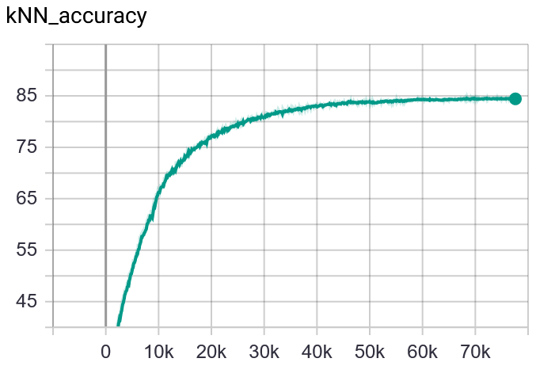
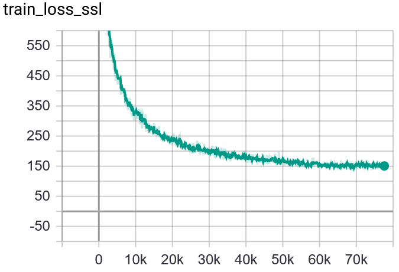

# barlowtwins
PyTorch Implementation of Barlow Twins paper: [Barlow Twins: Self-Supervised Learning via Redundancy Reduction](https://arxiv.org/pdf/2103.03230.pdf)

This is currently a work in progress. The code is a modified version of the SimSiam implementation [here](https://github.com/IgorSusmelj/simsiam-cifar10) 

- Time per epoch is around 40 seconds on a V100 GPU
- GPU usage is around 9 GBytes
- The current version reaches around 84.7% test accuracy

**Todo:**

- [X] warmup learning rate from 0
- [X] report results on cifar-10
- [ ] create PR to add to lightly

### Installation

`pip install -r requirements.txt`

### Dependencies

- PyTorch
- PyTorch Lightning
- Torchvision
- lightly

### Benchmarks
We benchmark the BarlowTwins model on the CIFAR-10 dataset following the KNN evaluation protocol. Currently, the best effort achieved a test accuracy of 84.7%.

Accuracy             |  Loss 
:-------------------------:|:-------------------------:
  |  

### Paper

[Barlow Twins: Self-Supervised Learning via Redundancy Reduction](https://arxiv.org/pdf/2103.03230.pdf)
